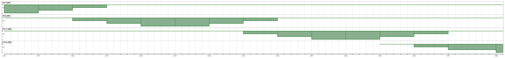

# 802.11 Design Datasheets/Suggestions

* Wifi 6E = 802.11ax(6G)
* Wifi 6 = 802.11ax
* Wifi 5 = 802.11ac
* Wifi 4 = 802.11n

## Standards
| Name     | Freq(Hz)    | Bandwidth(Hz)        | Modulator              | Spatial Steams(SS/NSS) | MaxSpeed(bit/s)                                           |
| -------- | ----------- | -------------------- | ---------------------- | ---------------------- | --------------------------------------------------------- |
| 802.11a  | 5 G         | 5/10/20 M            | OFDM                   |                        | 13.5/27/54 M                                              |
| 802.11ac | 2.4 G       | 20/40/80/80+80/160 M | MCS 7/MCS 9(/1024-QAM) | 1~4                    | 150/300/400/450/600/(750/)800(/1000) M                    |
|          | 5 G         | 20/40/80/80+80/160 M | MCS 7/MCS 9/1024-QAM   | 1~4                    | 433/650/867/975/1300/1625/1733/2167/1300+1300/2167+2167 M |
| 802.11ad | 60 G        | 2/160 M              | OFDM                   |                        | 0.85/6.7 G                                                |
| 802.11ax | 2.4/5(/6) G | 20/40/80/80+80/160 M | MIMO-OFDM/OFDMA        | 1~8                    | 1147/2294/4804/4804+4804/9608 M                           |
| 802.11b  | 2.4 G       | 22 M                 | DSSS                   |                        | 11 M                                                      |
| 802.11g  | 2.4 G       | 20 M                 | OFDM                   |                        | 54 M                                                      |
| 802.11n  | 2.4 G       | 20/40 M              | MIMO-OFDM (MCS 7)      |                        | 72.2/150 M                                                |
|          | 5 G         | 20/40 M              | MIMO-OFDM (MCS 9)      |                        | 288.8/600 M                                               |

More information about MCS and Speed, please check [MCS Table (Updated with 802.11ax Data Rates)](https://semfionetworks.com/blog/mcs-table-updated-with-80211ax-data-rates/) and [Aruba 802.11AX White Paper](https://www.arubanetworks.com/assets/wp/WP_802.11AX.pdf)
## MCS

| MCS Index | Modulation | Coding | RSSI Worst Min |
| --        | --         | --     | --             |
| 0         | BPSK       | 1/2    | -73            |
| 1         | QPSK       | 1/2    | -70            |
| 2         | QPSK       | 3/4    | -68            |
| 3         | 16-QAM     | 2/3    | -65            |
| 4         | 16-QAM     | 3/4    | -61            |
| 5         | 64-QAM     | 2/3    | -57            |
| 6         | 64-QAM     | 3/4    | -56            |
| 7         | 64-QAM     | 5/6    | -55            |
| 8         | 256-QAM    | 3/4    | -50            |
| 9         | 256-QAM    | 5/6    | -48            |
| 10        | 1024-QAM   | 3/4    | -43 (Predict)  |
| 11        | 1024-QAM   | 5/6    | -41 (Predict)  |

## Non-overlapping Channels

### Wifi channel auto-selection
After 802.11n , Standard request :
* ACS or DFS(Dynamic Frequency Selection), [hostapd](https://w1.fi/cgit/hostap/plain/hostapd/hostapd.conf)

### 802.11b/g/n

| F(Hz)    | BW(Hz) | Channels                                                                                               |
| -------- | -----  | ----------------------------------------------------------------------------------------------------   |
| 2.4 G    | 20 M   | DSSS: 1,6,11,14  OFDM : 1,5,9,13  OFDM NA : 1,6,11                                                     |
|          | 40 M   | OFDM : 1(+5),9(+13)  OFDM NA : 3 or 1+6,1+11,3+11                                                      |
|          | 80 M   | 9                                                                                                      |
| 5 G      | 20 M   | (32,)36,40,44,48,52,56,60,64,68,96,100,104,108,112,116,120,124,128,132,136,140,144,149,153,157,161,165 |
|          | 40 M   | Device support 20M+20M Channel                                                                         |

* 2.4G



## CRDA Code

Get Device Code

```bash
# iw reg get
global
country TW: DFS-FCC
        (2400 - 2483 @ 40), (N/A, 30), (N/A)
        (5150 - 5250 @ 80), (N/A, 23), (N/A), AUTO-BW
        (5250 - 5350 @ 80), (N/A, 23), (0 ms), DFS, AUTO-BW
        (5470 - 5730 @ 160), (N/A, 23), (0 ms), DFS
        (5725 - 5850 @ 80), (N/A, 30), (N/A)
        (57000 - 66000 @ 2160), (N/A, 40), (N/A)
```

Linux Kernel CRDA Source :

```http
https://git.kernel.org/pub/scm/linux/kernel/git/mcgrof/crda.git/
```

## DFS and Weather radar

DFS Band -> Scan radar every 60 sec ->  Transmit Delay (Online/Backgroud Working) 

## Tips
* Check Device Capabilities 
```bash
# iw dev <name> link
# iw phy
```

## Tools/Hardwares

### Commercial 
| Name                                   | Type           |
| -------------------------------------- | -------------- |
| TamoGraph Site Survey                  | Design         |
| Ekahau HeatMapper                      | Design         |
| SolarWinds Wifi Heat Map               | Design         |
| NetSpot                                | Design         |
| VisiWave                               | Design         |
| AirMagnet Survey PRO                   | Design         |
|                                        |                |
| Paessler PRTG Network Monitor          | Monitoring     |
| SolarWinds Network Performance Monitor | Monitoring     |
| Tarlogic Acrylic Wi-Fi Home            | Monitoring     |
| Microsoft Wifi Analyzer                | Monitoring     |
| Microsoft WiFi Commander               | App:Monitoring |
| NetCut                                 | Monitoring     |
| InSSIDer                               | Monitoring     |
| WiFi Analyzer                          | App:Monitoring |
| Vistumbler                             | Monitoring     |
|                                        |                |
| Wireshark                              | Debug          |
|                                        |                |
| Ubiquiti Unifi Controller              | AllInOne       |
| Fortinet FortiWifi                     | AllInOne       |
| MikroTik Wifi                          | AllInOne       |
| Ruckus Networks                        | AllInOne       |
| Aruba                                  | AllInOne       |
| WatchGuard                             | AllInOne       |
| Cisco                                  | AllInOne       |
| Linksys                                | AllInOne       |
| NetGear                                | AllInOne       |
|                                        |                |
| Tektronix                              | Tester         |
| Rohde & Schwarz                        | Tester         |
| Anritsu                                | Tester         |
| Keysight                               | Tester         |
| NetAlly                                | Tester         |
| CSL                                    | Tester         |
| Flurk                                  | Tester         |
|                                        |                |
| ASUS(Taiwan)                           | Device Vendor  |
| D-Link(Taiwan)                         | Device Vendor  |
| TP-Link(China)                         | Device Vendor  |
| Zyxel(Taiwan)                          | Device Vendor  |
| DrayTek(Taiwan)                        | Device Vendor  |
| Tenda/騰達(China)                      | Device Vendor  |
| Totolink(Korea)                        | Device Vendor  |
| EDIMAX                                 | Device Vendor  |


### Draft
| Name                       | Type     | Free | Link                                                                                        |
| -------------------------- | -------- | ---- | ------------------------------------------------------------------------------------------- |
| Python-wifi-survey-heatmap | Analysis | Free | [jantman/python-wifi-survey-heatmap](https://github.com/jantman/python-wifi-survey-heatmap) |

## Openwrt Hardwares
| Vendor   | Model                                                                                        | Speed Data                                | Version  | Shop                                                      | Openwrt Firmware                                                                                                                                | OEM Firmware                                                                                            |
| -------- | -------------------------------------------------------------------------------------------- | ----------------------------              | -------- | --------------------------------------------------------- | ----------------------------------------------------------------------------------------------------------------------------------------------- | ------------------------------------------------------------------------------------------------------- |
| Totolink | [X5000R](https://www.totolink.net/data/upload/20200820/cebd64ca83fabb0c0f5abdd8c6dee828.pdf) | 2*2 , 11n HT40 , 11ac VHT160 , 11ax HE160 | snapshot | [PCHOME](https://24h.pchome.com.tw/prod/DRAF5L-A900B284Q) | [OpenWRT Snapshot](http://downloads.openwrt.org/snapshots/targets/ramips/mt7621/openwrt-ramips-mt7621-totolink_x5000r-squashfs-sysupgrade.bin)  | [Totolink Download](https://www.totolink.net/home/menu/detail/menu_listtpl/download/id/218/ids/36.html) |

# Ref

* https://openwrt.org/docs/guide-user/network/wifi/wifi_countrycode
* http://web.archive.org/web/20150821031013/http://chunchaichang.blogspot.tw/
