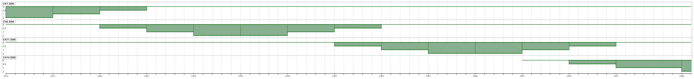

# 802.11 Design Datasheets/Suggests
- Draft
  - Li-Fi (IEEE P802.11bb Draft 6~)
  - Wi-Fi 7 = 802.11be
- Running
  - Wi-Fi 6E = 802.11ax(6G) = Wi-Fi 6 Release 2
  - Wi-Fi 6 = 802.11ax
  - Wi-Fi 5 = 802.11ac
  - Wi-Fi 4 = 802.11n

## Standards

- Flows = Spatial streams

| Name     | Frequency (GHz) | Bandwidth (MHz)                 | Shift (MHz) | Modulation (PHY)                 | Flows | Max Speed (bit/s)                                         |
| -------- | --------------- | ------------------------------- | ----------- | -------------------------------- | ----- | --------------------------------------------------------- |
| 802.11a  | 5               | 5/10/20                         | 20          | OFDM                             | -     | 13.5/27/54 M                                              |
| 802.11ac | 2.4             | 20/40/80/80+80/160              | 5           | MCS 7(/1024-QAM), VHT            | 8     | 150/300/400/450/600/(750/)800(/1000) M                    |
|          | 5               | 20/40/80/80+80/160              | 20          | MCS 9/1024-QAM, VHT & Part HE    | 8     | 433/650/867/975/1300/1625/1733/2167/1300+1300/2167+2167 M |
| 802.11ad | 60              | 2/160                           | 1.08,2.16 G | OFDM, DGM                        | -     | 0.85/6.7(/8.085) G                                        |
| 802.11ax | 2.4,5(,6)       | 20/40/80/80+80/160              | 5,20        | MIMO-OFDM/OFDMA, HE              | 8     | 1147/2294/4804/4804+4804/9608 M                           |
| 802.11b  | 2.4             | 22                              | 5           | HR/DSSS                          | -     | 11 M                                                      |
| 802.11bb | 800nm~1000nm    | 20 ~ 320                        | 26          | ODFM, 1024-QAM, LC(HT)           | -     | 10 M to 9.6 G                                             |
| 802.11be | 2.4,5,6         | 20/40/80/160/160+80/160+160/320 | 5,20        | ODFMA 4096-QAM, EHT              | 16    |                                                           |
| 802.11g  | 2.4             | 20                              | 5           | OFDM, ERP                        | -     | 54 M                                                      |
| 802.11n  | 2.4             | 20/40                           | 5           | MIMO-OFDM (MCS 7), HT            | 4     | 72.2/150 M                                                |
|          | 5               | 20/40                           | 20          | MIMO-OFDM (MCS 9), HT & Part VHT | 4     | 288.8/600 M                                               |

More information about MCS and Speed, please check [MCS Table (Updated with 802.11ax Data Rates)](https://semfionetworks.com/blog/mcs-table-updated-with-80211ax-data-rates/) and [Aruba 802.11AX White Paper](https://www.arubanetworks.com/assets/wp/WP_802.11AX.pdf)
## Frequency

- Network Control
  - 802.11k (Radio Resource Measurement)
  - 802.11v (Wireless Network Management)
  - 802.11r (Fast BSS Transition/FT)
- Protect 
  - 802.11w (Protected management frame + Security association)
- Mesh
  - 802.11s
### 2.4G 

```
Channel Number	Frequency Range (MHz)	Centre Frequency (MHz)	Availability
1	2401 - 2423	2412	Global
2	2406 - 2428	2417	Global
3	2411 - 2433	2422	Global
4	2416 - 2438	2427	Global
5	2421 - 2443	2432	Global
6	2426 - 2448	2437	Global
7	2431 - 2453	2442	Global
8	2436 - 2458	2447	Global
9	2441 - 2463	2452	Global
10	2446 - 2468	2457	Global
11	2451 - 2473	2462	Global
12	2456 - 2478	2467	Africa, Asia & Europe
13	2461 - 2483	2472	Africa, Asia & Europe
14	2473 - 2484	2482	Japan
```

1. [2.4 GHz Wi-Fi (802.11b/g/n) Channels and Frequency Band](https://www.everythingrf.com/community/2-4-ghz-wi-fi-802-11b-g-n-channels-and-frequency-band)
### 5G Frequency

- DFS (Dynamic Frequency Selection)
  - DFS Band → Scan radar every 60 sec → Transmit Delay (Online/Background Working) 
- TPC (Transmit Power Control)
- Both are for Weather radar.
- Related 802.11h-2003 and 802.11a

### 6G Frequency

- Based station/Access point
  - AFC (Automated Frequency Control)

1. [無線新技術2：Wi-Fi 6E](https://zhuanlan.zhihu.com/p/410819519)
## Modulation and PHY (Physical Layer)

- ODFM(802.11a)
  - HR/DSSS(802.11b)
  - ERP(802.11g)
  - HT(802.11n) and VHT(802.11ac)
  - DMG(802.11ad)
- ODFMA
  - HE(802.11ax)
  - EHT(802.11be)

1. [Wikipedia: Wi-Fi 6](https://en.wikipedia.org/wiki/Wi-Fi_6)
2. [Wikipedia: IEEE 802.11be](https://en.wikipedia.org/wiki/IEEE_802.11be)
### HT MCS

| MCS Index | Modulation | Coding | RSSI Worst Min |
| --------- | ---------- | ------ | -------------- |
| 0         | BPSK       | 1/2    | -73            |
| 1         | QPSK       | 1/2    | -70            |
| 2         | QPSK       | 3/4    | -68            |
| 3         | 16-QAM     | 2/3    | -65            |
| 4         | 16-QAM     | 3/4    | -61            |
| 5         | 64-QAM     | 2/3    | -57            |
| 6         | 64-QAM     | 3/4    | -56            |
| 7         | 64-QAM     | 5/6    | -55            |
| 8...      | BPSK...    | 1/2    | -73            |

### VHT MCS

| MCS Index | Modulation | Flow | Coding | RSSI Worst Min |
| --------- | ---------- | ---- | ------ | -------------- |
| 0         | BPSK       | 1    | 1/2    | -73            |
| 1         | QPSK       | 1    | 1/2    | -70            |
| 2         | QPSK       | 1    | 3/4    | -68            |
| 3         | 16-QAM     | 1    | 2/3    | -65            |
| 4         | 16-QAM     | 1    | 3/4    | -61            |
| 5         | 64-QAM     | 1    | 2/3    | -57            |
| 6         | 64-QAM     | 1    | 3/4    | -56            |
| 7         | 64-QAM     | 1    | 5/6    | -55            |
| 8         | 256-QAM    | 1    | 3/4    | -50            |
| 9         | 256-QAM    | 1    | 5/6    | -48            |
| 0...      | BPSK...    | 2... | 1/2    | -73            |

### HE MCS
- DCM (Dual sub-Carrier Modulation)
  - DCM supports up to 2 flow, others are vendors' feature.
- Tones (26, 52, 106, 242, 484, 996, 2x996)

| MCS Index | DCM  | Modulation | Flow | Coding | RSSI Worst Min |
| --------- | ---- | ---------- | ---- | ------ | -------------- |
| 0         | 0    | BPSK       | 1    | 1/2    | -73            |
| 0         | 1    | BPSK       | 1    | 1/2    | -73            |
| 1         | 0    | QPSK       | 1    | 1/2    | -70            |
| 1         | 1    | QPSK       | 1    | 1/2    | -70            |
| 2         | 0    | QPSK       | 1    | 3/4    | -68            |
| 2         | 1    | QPSK       | 1    | 3/4    | -68            |
| 3         | 0    | 16-QAM     | 1    | 2/3    | -65            |
| 3         | 1    | 16-QAM     | 1    | 2/3    | -65            |
| 4         | 0    | 16-QAM     | 1    | 3/4    | -61            |
| 4         | 1    | 16-QAM     | 1    | 3/4    | -61            |
| 5         | -    | 64-QAM     | 1    | 2/3    | -57            |
| 6         | -    | 64-QAM     | 1    | 3/4    | -56            |
| 7         | -    | 64-QAM     | 1    | 5/6    | -55            |
| 8         | -    | 256-QAM    | 1    | 3/4    | -50            |
| 9         | -    | 256-QAM    | 1    | 5/6    | -48            |
| 10        | -    | 1024-QAM   | 1    | 3/4    | -43 (Predict)  |
| 11        | -    | 1024-QAM   | 1    | 5/6    | -41 (Predict)  |
| 0...      | 0... | BPSK...    | 2... | 1/2    | -73            |

### EHT MCS

 - Tones Limits
   - Small-size :
     - 26+106 at 20/40 MHz
	 - 26+52 at 20/40/80 MHz
   - Large-size : 
     - 242+484 at 80 MHz
     - 484+996, 242+484+996 at 160 MHz
     - 2x996, 484+2x996 at 240 MHz
     - 3x996, 484+3x996 at 320 MHz


1. [IEEE 802.11be – Wi-Fi 7: New Challenges and Opportunities](https://arxiv.org/pdf/2007.13401.pdf)

| MCS Index | DCM  | Modulation | Flow | Coding | RSSI Worst Min |
| --------- | ---- | ---------- | ---- | ------ | -------------- |
| 0         | 0    | BPSK       | 1    | 1/2    | -73            |
| 0         | 1    | BPSK       | 1    | 1/2    | -73            |
| 1         | 0    | QPSK       | 1    | 1/2    | -70            |
| 1         | 1    | QPSK       | 1    | 1/2    | -70            |
| 2         | 0    | QPSK       | 1    | 3/4    | -68            |
| 2         | 1    | QPSK       | 1    | 3/4    | -68            |
| 3         | 0    | 16-QAM     | 1    | 2/3    | -65            |
| 3         | 1    | 16-QAM     | 1    | 2/3    | -65            |
| 4         | 0    | 16-QAM     | 1    | 3/4    | -61            |
| 4         | 1    | 16-QAM     | 1    | 3/4    | -61            |
| 5         | -    | 64-QAM     | 1    | 2/3    | -57            |
| 6         | -    | 64-QAM     | 1    | 3/4    | -56            |
| 7         | -    | 64-QAM     | 1    | 5/6    | -55            |
| 8         | -    | 256-QAM    | 1    | 3/4    | -50            |
| 9         | -    | 256-QAM    | 1    | 5/6    | -48            |
| 10        | -    | 1024-QAM   | 1    | 3/4    | -43 (Predict)  |
| 11        | -    | 1024-QAM   | 1    | 5/6    | -41 (Predict)  |
| 12        | -    | 4096-QAM   | 1    | 3/4    | -35 (Predict)  |
| 13        | -    | 4096-QAM   | 1    | 5/6    | -33 (Predict)  |
| 14        | -    | BPSK       | 1    | 1/2    | -73            |
| 15        | -    | BPSK       | 1    | 1/2    | -70            |
| 0...      | 0... | BPSK...    | 2... | 1/2    | -73            |

## Non-overlapping Channels

### Wi-Fi channel auto-selection

After 802.11n, Standard request :
* ACS (Auto Channel Selection) and DFS(Dynamic Frequency Selection), [hostapd](https://w1.fi/cgit/hostap/plain/hostapd/hostapd.conf)

### 802.11b/g/n

| F(Hz)    | BW(Hz) | Channels                                                                                               |
| -------- | -----  | ----------------------------------------------------------------------------------------------------   |
| 2.4 G    | 20 M   | DSSS: 1,6,11,14  OFDM : 1,5,9,13  OFDM NA : 1,6,11                                                     |
|          | 40 M   | OFDM : 1(+5),9(+13)  OFDM NA : 3 or 1+6,1+11,3+11                                                      |
|          | 80 M   | 9                                                                                                      |
| 5 G      | 20 M   | (32,)36,40,44,48,52,56,60,64,68,96,100,104,108,112,116,120,124,128,132,136,140,144,149,153,157,161,165 |
|          | 40 M   | Device support 20M+20M Channel                                                                         |

* 2.4G

- 5G (The image is from Internet unknown resource.)


## CRDA Code

Region Restriction

- Get Device Code

```bash
# iw reg get
global
country 00: DFS-UNSET
	(755 - 928 @ 2), (N/A, 20), (N/A), PASSIVE-SCAN
	(2402 - 2472 @ 40), (N/A, 20), (N/A)
	(2457 - 2482 @ 20), (N/A, 20), (N/A), AUTO-BW, PASSIVE-SCAN
	(2474 - 2494 @ 20), (N/A, 20), (N/A), NO-OFDM, PASSIVE-SCAN
	(5170 - 5250 @ 80), (N/A, 20), (N/A), AUTO-BW, PASSIVE-SCAN
	(5250 - 5330 @ 80), (N/A, 20), (0 ms), DFS, AUTO-BW, PASSIVE-SCAN
	(5490 - 5730 @ 160), (N/A, 20), (0 ms), DFS, PASSIVE-SCAN
	(5735 - 5835 @ 80), (N/A, 20), (N/A), PASSIVE-SCAN
	(57240 - 63720 @ 2160), (N/A, 0), (N/A)
```

Linux Kernel CRDA Source :

```http
https://git.kernel.org/pub/scm/linux/kernel/git/sforshee/wireless-regdb.git
```

- 6 GHz Band required the base station support.

## Tips

* Check Device Capabilities 

```bash
# iw dev <name> link
# iw phy
```

## Tools and Hardware

### OpenWrt
- Config : [Wi-Fi /etc/config/wireless](https://openwrt.org/docs/guide-user/network/wifi/basic)
- Enable WPA3+802.11kvr : https://vicfree.com/2022/11/openwrt-wpa3-802.11kvr-ap-setup/
### Commercial 

#### Software

| Name                                   | Type           |
| -------------------------------------- | -------------- |
| TamoGraph Site Survey                  | Design         |
| Ekahau HeatMapper                      | Design         |
| SolarWinds Wifi Heat Map               | Design         |
| NetSpot                                | Design         |
| VisiWave                               | Design         |
| AirMagnet Survey PRO                   | Design         |
|                                        |                |
| Paessler PRTG Network Monitor          | Monitoring     |
| SolarWinds Network Performance Monitor | Monitoring     |
| Tarlogic Acrylic Wi-Fi Home            | Monitoring     |
| Microsoft Wifi Analyzer                | Monitoring     |
| Microsoft WiFi Commander               | App:Monitoring |
| NetCut                                 | Monitoring     |
| InSSIDer                               | Monitoring     |
| WiFi Analyzer                          | App:Monitoring |
| Vistumbler                             | Monitoring     |
|                                        |                |
| Wireshark                              | Debug          |
|                                        |                |

#### Total solution / Enterprise

| Name                      | Type     |
| ------------------------- | -------- |
| Ubiquiti Unifi Controller | AllInOne |
| Fortinet FortiWifi        | AllInOne |
| MikroTik Wifi             | AllInOne |
| Ruckus Networks           | AllInOne |
| Aruba                     | AllInOne |
| WatchGuard                | AllInOne |
| Cisco                     | AllInOne |
| Linksys                   | AllInOne |
| NetGear                   | AllInOne |

#### Tester

| Name            | Type   |
| --------------- | ------ |
| Tektronix       | Tester |
| Rohde & Schwarz | Tester |
| Anritsu         | Tester |
| Keysight        | Tester |
| NetAlly         | Tester |
| CSL             | Tester |
| Flurk           | Tester |

#### Home/SOHO Wi-Fi Router

| Name               | Type          |
| ------------------ | ------------- |
| ASUS/華碩 (Taiwan) | Device Vendor |
| D-Link/友訊科技 (Taiwan) | Device Vendor |
| TP-Link (China) | Device Vendor |
| Zyxel/合勤科技 (Taiwan) | Device Vendor |
| DrayTek/居易科技 (Taiwan) | Device Vendor |
| Tenda/腾达 (China) | Device Vendor |
| Totolink/Zioncom (Hong Kong/China) | Device Vendor |
| EDIMAX/訊舟科技 (Taiwan) | Device Vendor |
| Mercusys/水星网络 (China) | Device Vendor |
| NetGear (US) | Device Vendor |
| HUAWEI/華為 (China) | Device Vendor |
| QNAP (Taiwan) | Device Vendor |
| TAMIO/塔米歐 (Taiwan) | Device Vendor |
| Xiaomi/小米 (China) | Device Vendor |

* Totolink/Zioncom
  * It's original from ipTime (EFM Networks Co., Ltd) , South Korea .
  * ZIONCOM HK ,Maxtop (Asia) Limited was established in 1999 .
  * Zioncom created a brand, Totolink for exportation in 2011 . [Zioncom - Milestones](https://web.archive.org/web/20240413064627/https://zioncom.net/a/guanyuwomen/Milestones/)
  * [2013 : Totolink.com.tw](https://web.archive.org/web/20130314154918/http://totolink.com.tw/about_1.php)
* TAMIO
  * NCC Applicant : 臺灣塔米歐實業股份有限公司
  * Distributor History : TP-Link , TOTOLINK , HUAWEI

### Draft

| Name                       | Type     | Free | Link                                                                                        |
| -------------------------- | -------- | ---- | ------------------------------------------------------------------------------------------- |
| Python-wifi-survey-heatmap | Analysis | Free | [jantman/python-wifi-survey-heatmap](https://github.com/jantman/python-wifi-survey-heatmap) |

## OpenWrt Hardware

- HT40 = HT (modulation standard) + 40 MHz bandwidth.
- Some of the products are not fully having those features.
  - Like 802.11ax = HE160, 802.11ac wave 2 = VHT160, 802.11ac wave 1 = VHT80 

| Vendor   | FCC                                     | Model                                                                                        | Speed Data                                                                            | Version  | Shop                                                      | Openwrt Firmware                                                                                                                               | OEM Firmware                                                                                            |
| -------- | --------------------------------------- | -------------------------------------------------------------------------------------------- | ------------------------------------------------------------------------------------- | -------- | --------------------------------------------------------- | ---------------------------------------------------------------------------------------------------------------------------------------------- | ------------------------------------------------------------------------------------------------------- |
| Totolink | FCC : X7DIP04433 , NCC : CCAP20LP1980T9 | [X5000R](https://www.totolink.net/data/upload/20200820/cebd64ca83fabb0c0f5abdd8c6dee828.pdf) | 2 * 2 , 11n HT40 , 11ac **VHT80** , 11ax **HE80** (AX1800) 2.4G 600Mbps + 5G 1200Mbps | snapshot | [PCHOME](https://24h.pchome.com.tw/prod/DRAF5L-A900B284Q) | [OpenWRT Snapshot](http://downloads.openwrt.org/snapshots/targets/ramips/mt7621/openwrt-ramips-mt7621-totolink_x5000r-squashfs-sysupgrade.bin) | [Totolink Download](https://www.totolink.net/home/menu/detail/menu_listtpl/download/id/218/ids/36.html) |

## Cards

| Vendor | FCC              | Model | Speed Data                                   |
| ------ | ---------------- | ----- | -------------------------------------------- |
| Intel  | FCC : PD9AX210NG | AX210 | 2 * 2  , 11n HT40 , 11ac VHT160 , 11ax HE160 |

## Regulation

RF Model Standard and Reports
* US : [FCC ID Search](https://www.fcc.gov/oet/ea/fccid)
* TW : [NCC 型式認證資料查詢](https://nccmember.ncc.gov.tw/Application/Fun/Fun016.aspx)
* JP : [技術基準適合証明等を受けた機器の検索](https://www.tele.soumu.go.jp/giteki/SearchServlet?pageID=js01)
* KR : [Search KC Certification Status](https://ccac.rra.go.kr/en/view/sub201020.jsp)
* AU : [ERAC National Certification Database](https://equipment.erac.gov.au/Public/)
* SG : [IMDA Equipment Search](https://eservice.imda.gov.sg/tls/searchEquipment.action)
* EU/JP/UK : CE - [Certipedia](https://www.certipedia.com/)
* ID : SNI
* MY : MCMC , [Model Enquiry](https://ecomm.sirim.my/SirimEnquiry/modelenquiry.aspx)
* TH : NBTC

Wifi Alliance
* [Wi-Fi CERTIFIED products](https://www.wi-fi.org/product-finder)

# Ref

* https://openwrt.org/docs/guide-user/network/wifi/wifi_countrycode
* http://web.archive.org/web/20150821031013/http://chunchaichang.blogspot.tw/
* https://wikidevi.wi-cat.ru/List_of_802.11ax_Hardware (Wifi6 Hardware Datasheet Wiki)
* https://cdn.rohde-schwarz.com/tw/downloads_47/common_library_47/brochures_and_datasheets_47/1MA222_802.11ax_A.pdf (R&S 802.11ax 技術介紹白皮書)
