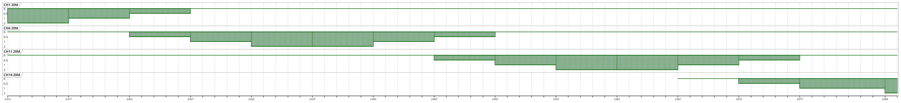

# 802.11 Design Datasheets/Suggesties
* Li-Fi (IEEE P802.11bb Draft 6~)
* Wi-Fi 6E = 802.11ax(6G) = Wi-Fi 6 Release 2
* Wi-Fi 6 = 802.11ax
* Wi-Fi 5 = 802.11ac
* Wi-Fi 4 = 802.11n

## Standards

| Name     | Frequency(Hz) | Bandwidth(Hz)            | Shift(MHz)  | Modulation             | Spatial Steams | Max Speed(bit/s)                                          |
| -------- | ------------- | ------------------------ | ----------- | ---------------------- | -------------- | --------------------------------------------------------- |
| 802.11a  | 5 G           | 5/10/20 M                | 20          | OFDM                   |                | 13.5/27/54 M                                              |
| 802.11ac | 2.4 G         | 20/40/80/80+80/160 M     | 5           | MCS 7/MCS 9(/1024-QAM) | 1~4            | 150/300/400/450/600/(750/)800(/1000) M                    |
|          | 5 G           | 20/40/80/80+80/160 M     | 20          | MCS 7/MCS 9/1024-QAM   | 1~4            | 433/650/867/975/1300/1625/1733/2167/1300+1300/2167+2167 M |
| 802.11ad | 60 G          | 2/160 M                  | 1.08,2.16 G | OFDM                   |                | 0.85/6.7 G                                                |
| 802.11ax | 2.4,5(,6) G   | 20/40/80/80+80/160 M     | 5,20        | MIMO-OFDM/OFDMA        | 1~8            | 1147/2294/4804/4804+4804/9608 M                           |
| 802.11b  | 2.4 G         | 22 M                     | 5           | DSSS                   |                | 11 M                                                      |
| 802.11bb | 800nm~1000nm  | 20 M ~ 320 M             | 26          | ODFM  1024-QAM         |                | 10 M to 9.6 G                                             |
| 802.11be | 2.4,5,6 G     | 160+80/240/160+160/320 M | 5,20        | ODFMA 4096-QAM         | 1~16           |                                                           |
| 802.11g  | 2.4 G         | 20 M                     | 5           | OFDM                   |                | 54 M                                                      |
| 802.11n  | 2.4 G         | 20/40 M                  | 5           | MIMO-OFDM (MCS 7)      |                | 72.2/150 M                                                |
|          | 5 G           | 20/40 M                  | 20          | MIMO-OFDM (MCS 9)      |                | 288.8/600 M                                               |

More information about MCS and Speed, please check [MCS Table (Updated with 802.11ax Data Rates)](https://semfionetworks.com/blog/mcs-table-updated-with-80211ax-data-rates/) and [Aruba 802.11AX White Paper](https://www.arubanetworks.com/assets/wp/WP_802.11AX.pdf)

## 2.4G Frequency 
```
Channel Number	Frequency Range (MHz)	Centre Frequency (MHz)	Availability
1	2401 - 2423	2412	Global
2	2406 - 2428	2417	Global
3	2411 - 2433	2422	Global
4	2416 - 2438	2427	Global
5	2421 - 2443	2432	Global
6	2426 - 2448	2437	Global
7	2431 - 2453	2442	Global
8	2436 - 2458	2447	Global
9	2441 - 2463	2452	Global
10	2446 - 2468	2457	Global
11	2451 - 2473	2462	Global
12	2456 - 2478	2467	Africa, Asia & Europe
13	2461 - 2483	2472	Africa, Asia & Europe
14	2473 - 2484	2482	Japan
```

1. [2.4 GHz Wi-Fi (802.11b/g/n) Channels and Frequency Band](https://www.everythingrf.com/community/2-4-ghz-wi-fi-802-11b-g-n-channels-and-frequency-band)

## MCS

| MCS Index     | Modulation | Coding | RSSI Worst Min |
| ------------- | ---------- | ------ | -------------- |
| 0             | BPSK       | 1/2    | -73            |
| 1             | QPSK       | 1/2    | -70            |
| 2             | QPSK       | 3/4    | -68            |
| 3             | 16-QAM     | 2/3    | -65            |
| 4             | 16-QAM     | 3/4    | -61            |
| 5             | 64-QAM     | 2/3    | -57            |
| 6             | 64-QAM     | 3/4    | -56            |
| 7             | 64-QAM     | 5/6    | -55            |
| 8             | 256-QAM    | 3/4    | -50            |
| 9             | 256-QAM    | 5/6    | -48            |
| 10 (11ax ...) | 1024-QAM   | 3/4    | -43 (Predict)  |
| 11 (11ax ...) | 1024-QAM   | 5/6    | -41 (Predict)  |

## Non-overlapping Channels

### Wi-Fi channel auto-selection
After 802.11n , Standard request :
* ACS or DFS(Dynamic Frequency Selection), [hostapd](https://w1.fi/cgit/hostap/plain/hostapd/hostapd.conf)

### 802.11b/g/n

| F(Hz)    | BW(Hz) | Channels                                                                                               |
| -------- | -----  | ----------------------------------------------------------------------------------------------------   |
| 2.4 G    | 20 M   | DSSS: 1,6,11,14  OFDM : 1,5,9,13  OFDM NA : 1,6,11                                                     |
|          | 40 M   | OFDM : 1(+5),9(+13)  OFDM NA : 3 or 1+6,1+11,3+11                                                      |
|          | 80 M   | 9                                                                                                      |
| 5 G      | 20 M   | (32,)36,40,44,48,52,56,60,64,68,96,100,104,108,112,116,120,124,128,132,136,140,144,149,153,157,161,165 |
|          | 40 M   | Device support 20M+20M Channel                                                                         |

* 2.4G

- 5G (The image is from Internet unknown resource.)


## CRDA Code

Region Restriction

- Get Device Code

```bash
# iw reg get
global
country 00: DFS-UNSET
	(755 - 928 @ 2), (N/A, 20), (N/A), PASSIVE-SCAN
	(2402 - 2472 @ 40), (N/A, 20), (N/A)
	(2457 - 2482 @ 20), (N/A, 20), (N/A), AUTO-BW, PASSIVE-SCAN
	(2474 - 2494 @ 20), (N/A, 20), (N/A), NO-OFDM, PASSIVE-SCAN
	(5170 - 5250 @ 80), (N/A, 20), (N/A), AUTO-BW, PASSIVE-SCAN
	(5250 - 5330 @ 80), (N/A, 20), (0 ms), DFS, AUTO-BW, PASSIVE-SCAN
	(5490 - 5730 @ 160), (N/A, 20), (0 ms), DFS, PASSIVE-SCAN
	(5735 - 5835 @ 80), (N/A, 20), (N/A), PASSIVE-SCAN
	(57240 - 63720 @ 2160), (N/A, 0), (N/A)
```

Linux Kernel CRDA Source :

```http
https://git.kernel.org/pub/scm/linux/kernel/git/sforshee/wireless-regdb.git
```

- 6 GHz Band required the base station support.

## DFS and Weather radar

DFS Band → Scan radar every 60 sec → Transmit Delay (Online/Background Working) 

## Tips

* Check Device Capabilities 

```bash
# iw dev <name> link
# iw phy
```

## Tools and Hardware

### Commercial 

#### Software

| Name                                   | Type           |
| -------------------------------------- | -------------- |
| TamoGraph Site Survey                  | Design         |
| Ekahau HeatMapper                      | Design         |
| SolarWinds Wifi Heat Map               | Design         |
| NetSpot                                | Design         |
| VisiWave                               | Design         |
| AirMagnet Survey PRO                   | Design         |
|                                        |                |
| Paessler PRTG Network Monitor          | Monitoring     |
| SolarWinds Network Performance Monitor | Monitoring     |
| Tarlogic Acrylic Wi-Fi Home            | Monitoring     |
| Microsoft Wifi Analyzer                | Monitoring     |
| Microsoft WiFi Commander               | App:Monitoring |
| NetCut                                 | Monitoring     |
| InSSIDer                               | Monitoring     |
| WiFi Analyzer                          | App:Monitoring |
| Vistumbler                             | Monitoring     |
|                                        |                |
| Wireshark                              | Debug          |
|                                        |                |

#### Total solution / Enterprise 

| Name                      | Type     |
| ------------------------- | -------- |
| Ubiquiti Unifi Controller | AllInOne |
| Fortinet FortiWifi        | AllInOne |
| MikroTik Wifi             | AllInOne |
| Ruckus Networks           | AllInOne |
| Aruba                     | AllInOne |
| WatchGuard                | AllInOne |
| Cisco                     | AllInOne |
| Linksys                   | AllInOne |
| NetGear                   | AllInOne |

#### Tester

| Name                      | Type     |
| ------------------------- | -------- |
| Tektronix                 | Tester   |
| Rohde & Schwarz           | Tester   |
| Anritsu                   | Tester   |
| Keysight                  | Tester   |
| NetAlly                   | Tester   |
| CSL                       | Tester   |
| Flurk                     | Tester   |

#### Home/SOHO Wifi Router

| Name               | Type          |
| ------------------ | ------------- |
| ASUS (Taiwan)      | Device Vendor |
| D-Link (Taiwan)    | Device Vendor |
| TP-Link (China)    | Device Vendor |
| Zyxel (Taiwan)     | Device Vendor |
| DrayTek (Taiwan)   | Device Vendor |
| Tenda/騰達 (China) | Device Vendor |
| Totolink (Korea)   | Device Vendor |
| EDIMAX             | Device Vendor |
| Mercusys           | Device Vendor |
| NetGear            | Device Vendor |
| HUAWEI (China)     | Device Vendor |
| QNAP (Taiwan)      | Device Vendor |
| TAMIO              | Device Vendor |


### Draft

| Name                       | Type     | Free | Link                                                                                        |
| -------------------------- | -------- | ---- | ------------------------------------------------------------------------------------------- |
| Python-wifi-survey-heatmap | Analysis | Free | [jantman/python-wifi-survey-heatmap](https://github.com/jantman/python-wifi-survey-heatmap) |

## OpenWRT Hardware

| Vendor   | FCC                                     | Model                                                                                        | Speed Data                                                                            | Version  | Shop                                                      | Openwrt Firmware                                                                                                                               | OEM Firmware                                                                                            |
| -------- | --------------------------------------- | -------------------------------------------------------------------------------------------- | ------------------------------------------------------------------------------------- | -------- | --------------------------------------------------------- | ---------------------------------------------------------------------------------------------------------------------------------------------- | ------------------------------------------------------------------------------------------------------- |
| Totolink | FCC : X7DIP04433 , NCC : CCAP20LP1980T9 | [X5000R](https://www.totolink.net/data/upload/20200820/cebd64ca83fabb0c0f5abdd8c6dee828.pdf) | 2 * 2 , 11n HT40 , 11ac **VHT80** , 11ax **HE80** (AX1800) 2.4G 600Mbps + 5G 1200Mbps | snapshot | [PCHOME](https://24h.pchome.com.tw/prod/DRAF5L-A900B284Q) | [OpenWRT Snapshot](http://downloads.openwrt.org/snapshots/targets/ramips/mt7621/openwrt-ramips-mt7621-totolink_x5000r-squashfs-sysupgrade.bin) | [Totolink Download](https://www.totolink.net/home/menu/detail/menu_listtpl/download/id/218/ids/36.html) |

## Cards

| Vendor | FCC | Model | Speed Data |
| ------ | --- | ----- | ----- |
| Intel  | FCC : PD9AX210NG | AX210 | 2 * 2  , 11n HT40 , 11ac VHT160 , 11ax HE160 |

## Certifications
RF Model Standard and Reports
* US : [FCC ID Search](https://www.fcc.gov/oet/ea/fccid)
* TW : [NCC 型式認證資料查詢](https://nccmember.ncc.gov.tw/Application/Fun/Fun016.aspx)
* JP : [技術基準適合証明等を受けた機器の検索](https://www.tele.soumu.go.jp/giteki/SearchServlet?pageID=js01)
* KR : [Search KC Certification Status](https://ccac.rra.go.kr/en/view/sub201020.jsp)
* AU : [ERAC National Certification Database](https://equipment.erac.gov.au/Public/)
* SG : [IMDA Equipment Search](https://eservice.imda.gov.sg/tls/searchEquipment.action)

# Ref

* https://openwrt.org/docs/guide-user/network/wifi/wifi_countrycode
* http://web.archive.org/web/20150821031013/http://chunchaichang.blogspot.tw/
* https://wikidevi.wi-cat.ru/List_of_802.11ax_Hardware (Wifi6 Hardware Datasheet Wiki)
* https://cdn.rohde-schwarz.com/tw/downloads_47/common_library_47/brochures_and_datasheets_47/1MA222_802.11ax_A.pdf (R&S 802.11ax 技術介紹白皮書)
